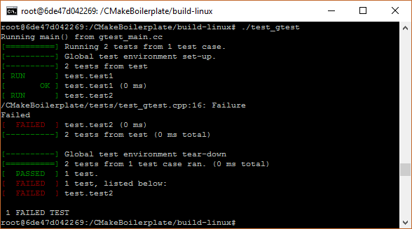

# CMake Boilerplate
This boilerplate creates a unit-tested C++ application/library which uses CMake for cross-platform builds.

 > CMake is used to control the software compilation process using simple platform and compiler independent configuration files,
 > and generate native makefiles and workspaces that can be used in the compiler environment of your choice - [CMake](https://cmake.org/)

This boilerplate aims to keep things simple, use modern CMake features, and provide a good starting point for developers new to cmake.

## Features
* A C++ application/library that can be edited, built and tested on Windows/Linux
* Uses powerful CMake functionality to minimise the use of platform specific code
* Testing with [Google Test/Mock](https://github.com/google/googletest).
* Use of [Docker](https://www.docker.com/) for easy Linux debugging from a Windows environment.

## Dependencies
* C++ build tools
* CMake 3.4.3 or newer
* Git
* Docker for Windows (optional)

## Building
### Command Line (Linux)
```bash
mkdir -p build-linux && cd "$_" && cmake .. && make
```
OR
```bash
./build-scripts/setup_build_linux.sh && cd build-linux && ./build_all.sh
```
### IDE
Full CMake build support without a project file is supported in most common IDEs:
* Visual Studio 2017 (Windows)
* JetBrains CLion (Cross-platform)
* QTCreator (Cross-platform)
* Visual Studio Code (Cross-platform) with [CMake Tools](https://github.com/vector-of-bool/vscode-cmake-tools)
* See [link](https://cmake.org/Wiki/CMake_Editors_Support) for more

## Running Tests
### Using Generated Google Test Executables
Google test produces executables which cleanly indicate test results, so IDE integration is not essential.
Simply run the generated test executable and you will see output as below:


### Integrated Testing with IDEs
In-editor Google Test integration is not common at this stage, but it is available in
* JetBrains CLion
* QTCreator with this [plugin](https://github.com/OneMoreGres/qtc-gtest)
* Visual Studio 2017 with [ReSharper](https://www.jetbrains.com/resharper/), although this functionality is not currently working for CMake projects in Visual Studio 2017 RC

## Creating a Docker Container
The `docker_build` script create an Ubuntu 14.04 container with c++ build tools/CMake.
The `docker_start` script mounts the project directory and sets it as the working directory.
### Windows
```bash
cd docker
docker_build.bat
docker_start.bat
```
### Linux
```bash
cd docker
./docker_build.sh
./docker_start.sh
```

## Issues:
* Not tested on Mac or any flavours of Linux aside from Ubuntu 14.04
